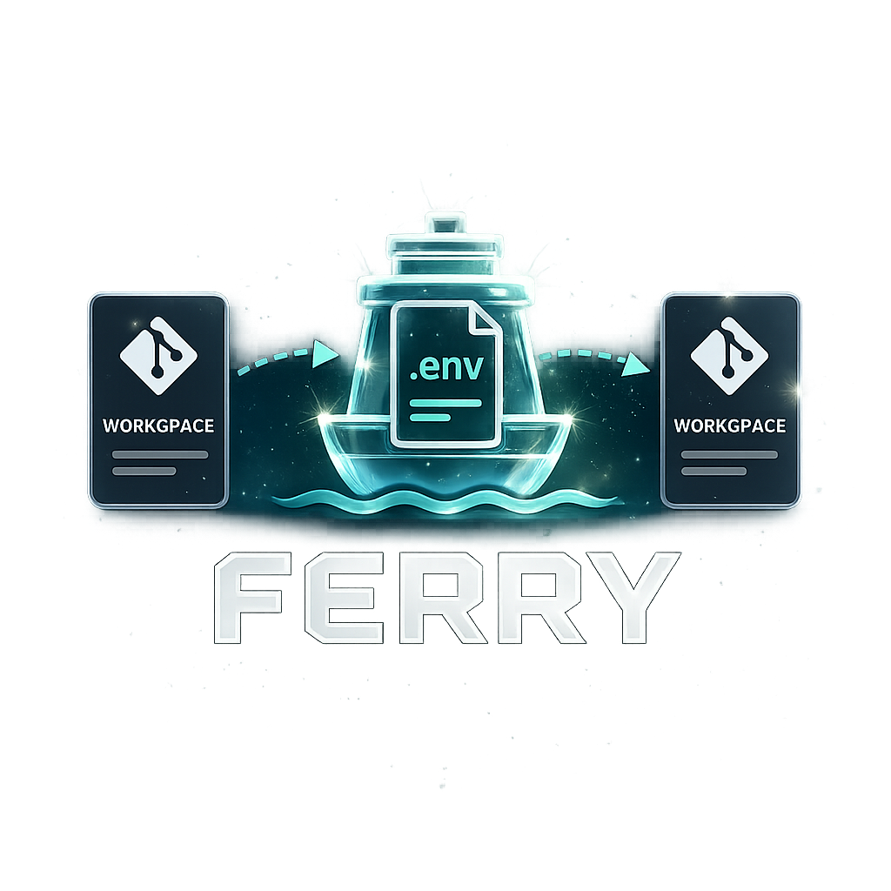

<p align="center">
  
</p>

# ferry

> Snapshot, encrypt, and restore your `.env` files across git worktrees and onboarding.

`ferry` is a small CLI tool that solves a specific annoying problem: when you create a new git worktree or onboard a teammate to a monorepo, all the gitignored `.env` files are missing, and reconstructing them is tedious and error-prone.

`ferry` lets you snapshot your env state, store it encrypted locally, and restore it with one command.

## Usage at a glance

```bash
# one-time setup in your repo
ferry key generate         # creates ~/.ferry/keys/default.txt
ferry init                 # discovers .env* files, writes ferry.toml

# whenever your env files change
ferry snapshot -m "rotated db password"

# in a new worktree or on a new machine
ferry apply                # restores the latest snapshot
```

That's the whole loop. See [Demo: end-to-end with git](#demo-end-to-end-with-git) for a worked example, or `ferry --help`.

## Why

If you work in a monorepo with multiple apps, you probably have a pile of env files: `.env`, `apps/api/.env.local`, `apps/web/.env.development`, and so on. None of them are in git (and shouldn't be). So every time you:

- Create a new `git worktree` for a feature branch
- Help a new teammate set up the repo
- Switch between projects on a new machine

...you have to manually copy or recreate those files. `ferry` automates this. Snapshot once, restore anywhere.

## How it works

1. `ferry init` scans your repo for env-style files and creates a `ferry.toml` config (safe to commit — it only contains paths and metadata, no secrets)
2. `ferry snapshot` encrypts the current state of those files using [age](https://github.com/FiloSottile/age) and stores it under `~/.ferry/snapshots/<project>/`
3. `ferry apply` in any worktree or new checkout restores the latest snapshot

The encryption key lives in `~/.ferry/keys/` and is never stored alongside snapshots. For onboarding, send the key to your teammate over a secure channel (1Password, Signal, etc.) once, and they can `ferry apply` forever after.

## Installation

Pick whichever fits your setup. ferry is a single static binary with no runtime dependencies.

### Option 1: `go install` (simplest if you have Go)

Requires **Go 1.22+**.

```bash
go install github.com/djleonskennedy/ferry/cmd/ferry@latest
```

The binary is installed to `$(go env GOBIN)` (falls back to `$(go env GOPATH)/bin`). Make sure that directory is in your `PATH`.

### Option 2: Prebuilt binary from GitHub Releases

Releases are published at <https://github.com/djleonskennedy/ferry/releases>. Each release ships five archives plus a `checksums.txt`:

| OS | Architecture | Archive |
|---|---|---|
| Linux | amd64 | `ferry_<version>_linux_amd64.tar.gz` |
| Linux | arm64 | `ferry_<version>_linux_arm64.tar.gz` |
| macOS | amd64 (Intel) | `ferry_<version>_darwin_amd64.tar.gz` |
| macOS | arm64 (Apple Silicon) | `ferry_<version>_darwin_arm64.tar.gz` |
| Windows | amd64 | `ferry_<version>_windows_amd64.zip` |

#### Linux / macOS one-liner

```bash
VERSION=$(curl -fsSL https://api.github.com/repos/djleonskennedy/ferry/releases/latest | grep -m1 tag_name | cut -d'"' -f4)
OS=$(uname -s | tr '[:upper:]' '[:lower:]')           # linux | darwin
ARCH=$(uname -m | sed 's/x86_64/amd64/;s/aarch64/arm64/')
curl -fsSL "https://github.com/djleonskennedy/ferry/releases/download/${VERSION}/ferry_${VERSION#v}_${OS}_${ARCH}.tar.gz" \
  | tar -xz -C /tmp ferry
sudo mv /tmp/ferry /usr/local/bin/ferry
ferry --version
```

#### Windows (PowerShell)

```powershell
$version = (Invoke-RestMethod https://api.github.com/repos/djleonskennedy/ferry/releases/latest).tag_name
$asset   = "ferry_$($version.TrimStart('v'))_windows_amd64.zip"
Invoke-WebRequest "https://github.com/djleonskennedy/ferry/releases/download/$version/$asset" -OutFile $asset
Expand-Archive $asset -DestinationPath . -Force
.\ferry.exe --version
# Move ferry.exe somewhere on your PATH.
```

### Option 3: Build from source

```bash
git clone https://github.com/djleonskennedy/ferry
cd ferry
make build                    # produces ./bin/ferry
# or:
make install                  # go install into $GOBIN
```

### Option 4: One-shot local install script

Builds with production-style flags (`-trimpath`, stripped, version-stamped) and drops the binary somewhere on `PATH`. Defaults to `~/.local/bin`; appends a line to your shell rc if that directory is not already on `PATH`.

```bash
./scripts/install.sh                          # default: ~/.local/bin
INSTALL_DIR=/usr/local/bin ./scripts/install.sh   # system-wide (uses sudo if needed)
./scripts/install.sh --no-path                # skip the rc edit
# or via make:
make install-local
```

### Verifying downloads

Each release publishes `checksums.txt`. After downloading any archive, verify it:

```bash
curl -fsSLO "https://github.com/djleonskennedy/ferry/releases/download/${VERSION}/checksums.txt"
shasum -a 256 -c checksums.txt --ignore-missing
```

### After install

Check the binary works:

```bash
ferry --version
ferry --help
```

Then follow the walkthrough below.

## Demo: end-to-end with git

A realistic flow from a fresh repo to restoring secrets in a new worktree.

### 1. You start with a repo that has env files

```bash
cd ~/projects/my-monorepo
ls -A
# .env  .env.local  apps/api/.env.local  .gitignore  …
```

Your `.gitignore` already excludes `.env*` (as it should). These files exist on your disk but not in git.

### 2. Generate an encryption key (once per machine)

```bash
ferry key generate
# Generated key default at ~/.ferry/keys/default.txt
# Recipient (public): age1yv4jwgy4j275pshjy2vreejygfc78jrpt3gyj393xrwcpajqeqgqmwgg4k
```

The private key lives at `~/.ferry/keys/default.txt` with mode `0600`. **Never** commit this file. Treat it like an SSH private key.

### 3. Initialize ferry in the repo

```bash
ferry init
# Created /Users/you/projects/my-monorepo/ferry.toml with 3 file(s):
#   .env
#   .env.local
#   apps/api/.env.local
# Review ferry.toml and remove anything you do not want to snapshot.
```

Open `ferry.toml` and trim the list if any non-secret files crept in.

### 4. Commit `ferry.toml` so teammates pick it up

`ferry.toml` contains only **paths and metadata** — no secret values. It belongs in git.

```bash
git add ferry.toml
git commit -m "Add ferry config for env snapshots"
git push
```

### 5. Take your first snapshot

```bash
ferry snapshot -m "initial"
# Created snapshot v1 (3 files, key=default)
#   ~/.ferry/snapshots/my-monorepo/v1
```

That `v1/env.age` is an age-encrypted tarball. It lives **outside** the repo (under `~/.ferry/`), so it won't accidentally end up in git.

### 6. Edit secrets, snapshot again

```bash
echo "FEATURE_FLAG=on" >> .env
ferry snapshot -m "added feature flag"
# Created snapshot v2 (3 files, key=default)

ferry list
# VERSION  CREATED                    KEY      FILES  LATEST  MESSAGE
# v1       2026-05-19T17:00:00+03:00  default  3              initial
# v2       2026-05-19T17:05:00+03:00  default  3      *       added feature flag
```

The `*` marks the version `apply` will restore by default.

### 7. Create a new worktree for a feature branch

```bash
git worktree add ../my-monorepo-feature-x
cd ../my-monorepo-feature-x
ls -A
# ferry.toml is here (from git), but no .env files (gitignored)
```

### 8. Restore the env files in the new worktree

```bash
ferry apply
# Applied snapshot v2 to /Users/you/projects/my-monorepo-feature-x
#   restored: 3
#   skipped (already same): 0
```

The new worktree now has the same env files as your main checkout. Start coding.

### 9. Check for drift before snapshotting again

```bash
echo "DEBUG=true" >> .env
ferry diff
# STATUS    PATH
# modified  .env
# same      .env.local
# same      apps/api/.env.local
# ferry: drift: snapshot v2 differs from disk
echo $?       # 1 — useful for pre-commit / CI scripts
```

When you're ready, `ferry snapshot` again to bump to `v3`.

### Recovering from a bad edit

```bash
# Accidentally mangled .env? Roll back to the latest snapshot:
ferry apply --force
# (your current .env is backed up to ~/.ferry/backups/<project>/<timestamp>/ first)
```

## Onboarding a teammate

```bash
# you (one time)
ferry key generate --id team-shared    # generate a shared key
# send the contents of ~/.ferry/keys/team-shared.txt over a secure channel

# them (one time)
ferry key import --id team-shared --from team-shared.txt
# now copy ~/.ferry/snapshots/<project>/ from you (or use a shared location)
ferry apply
```

A future version will add remote storage backends so you won't need to copy snapshot files manually.

## Commands

| Command | What it does |
|---|---|
| `ferry init` | Initialize ferry in current repo, create `ferry.toml` |
| `ferry scan` | Re-scan repo for env files, update `ferry.toml` |
| `ferry snapshot` | Create a new encrypted snapshot |
| `ferry apply` | Restore snapshot files to current directory |
| `ferry list` | List available snapshots |
| `ferry diff` | Show diff status between current files and a snapshot |
| `ferry key generate` | Create a new encryption key |
| `ferry key list` | List configured keys |
| `ferry key import` | Import an existing key |

Run `ferry <command> --help` for detailed flags.

## Safety

`ferry apply` will never silently overwrite your files. If a file already exists and differs from the snapshot, it aborts and shows you the list. Use `--force` to overwrite, and ferry will back up the existing file to `~/.ferry/backups/` first.

`ferry snapshot` refuses to write plaintext snapshots unless you explicitly opt in via `encryption.required = false` in `ferry.toml`. The default is encrypted.

The encryption key file is created with `0600` permissions and is never logged or transmitted by ferry.

## Configuration

### Project config — `./ferry.toml` (commit this)

```toml
[project]
name = "my-monorepo"

[encryption]
key_id = "default"
required = true

[[files]]
path = ".env"
required = true

[[files]]
path = "apps/api/.env.local"
required = true

[[files]]
path = "apps/web/.env.development"
required = false
```

### Global config — `~/.ferry/config.toml` (do not commit, do not share)

```toml
[keys.default]
path = "~/.ferry/keys/default.txt"

[defaults]
backup_on_apply = true
backup_retention = 10
snapshot_retention = 0   # 0 = keep all
```

## Storage layout

```
~/.ferry/
├── config.toml
├── keys/
│   └── default.txt              # age private key (mode 0600)
├── backups/
│   └── my-monorepo/
│       └── 2026-05-19T14-30-22Z/ # pre-apply backups
└── snapshots/
    └── my-monorepo/
        ├── v1/
        │   ├── manifest.toml
        │   └── env.age
        ├── v2/
        └── latest -> v2
```

## FAQ

**What about secrets I don't want my teammates to see?**
Don't snapshot them. `ferry` is for shared dev env state, not for personal API keys. Use a separate uncommitted `.env.local.private` and exclude it from `ferry.toml`.

**Can I use this for production secrets?**
No. Use a proper secret manager (Vault, AWS Secrets Manager, Doppler, 1Password). `ferry` is for developer convenience, not production secret distribution.

**Why not just use `git stash` or a private branch?**
Because env files are gitignored and `git` doesn't see them. And committing them — even to a private branch — leaks them into git history forever.

**Why not Doppler / Infisical / etc.?**
Those are great. `ferry` is for teams that don't want to introduce a SaaS dependency or run a server, and just want a local-first tool. If you're already on Doppler, stick with it.

**Does ferry work on Windows?**
Best-effort. Tested on macOS and Linux. The `latest` symlink falls back to a `latest.txt` pointer file on Windows.

## License

MIT

---

<p align="center">
  Powered by <a href="https://claude.com/claude-code">Claude Code</a> 😉 with a small help of Yurii &lt;3
</p>
